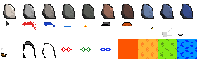
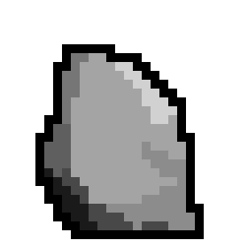
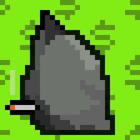

# D.I.Y. Rocks (Incl. Punks & Maxi Biz) Collection Starter


##  Wen Deploy? Wen Mint?

Here's everything to make it happen - yes, you can. 


### Step 1: Inscribe spritesheet.png (<3kb)




#### Step 2:  Inscribe the collection deploy text 

Note: Fill-in the inscribe / inscription id 
for the inscribed spritesheet.png above.


```
og deploy diyrocks
name: D.I.Y. Rocks (Incl. Punk & Maxi Biz)
max: 33
dim: 28x28
<inscribe_id_here>
```

That's it. Yes, you can - start a free mint (first-come/first-serve).

Wen [next] deploy?   You are welcome to announce your ordgen / ORC-721 collections
in the [ordinal punks](https://ordinalpunks.com) discord (in the #generative-orc-721 channel)
or in the [ordinal phunks](https://twitter.com/OrdinalPhunksV0) discord (in the #random / General channel).


### Rock Mint Samples


To find your g(enerative) numbers in range 0-29 (30) for the mint text - try the [D.I.Y. Rocks (Incl. Punks & Maxi Biz) Previewer »](https://orc721.github.io/rocks.starter/preview)




`og mint diyrocks 1`



`og mint diyrocks 28 3 10 19`


`og mint diyrocks 27 9 17 11 20`


`og mint diyrocks 26 22 24`


## Questions? Comments?

Please post in the [ordinal punks](https://ordinalpunks.com) discord (in the #generative-orc-721 channel)
or in the [ordinal phunks](https://twitter.com/OrdinalPhunksV0) discord (in the #random / General channel).
